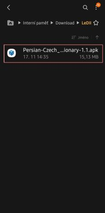
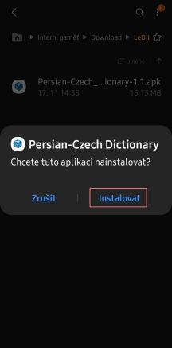
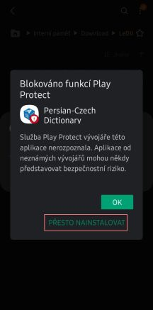
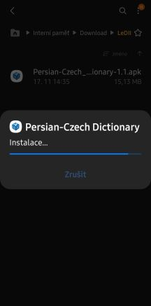
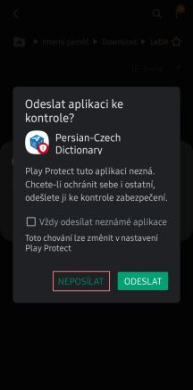
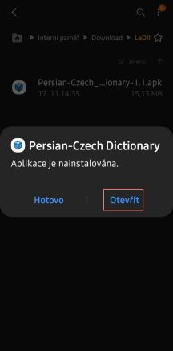
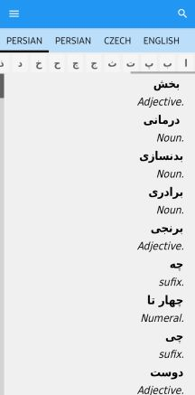

# LeDIIR Mobile Application

Projekt „Elektronická lexikální databáze indoíránských jazyků. Pilotní modul perština“, který je realizován s podporou Technologické agentury ČR ([TAČR](https://www.tacr.cz)) pod reg. č. [TL03000369](https://www.isvavai.cz/cep?ss=detail&n=0&h=TL03000369).

## Instalace mobilního slovníku

Popis instalace testovací verze persko-českého slovníku. Testovací verze se bude distribuovat prostřednictvím webového úložiště, tj. nikoli pomocí služby Google Play. To mj. znamená, že aplikaci musíte nejprve stáhnout (jde o 1 soubor) do svého mobilu, následně ji otevřít a nainstalovat. Systém Android se vás bude snažit od instalace a používání aplikace odradit, ale nemusíte se bát. Persko-český slovník je bezpečný.

Následuje popis kroků, pomocí nichž slovník spustíte a nainstalujete.

Nejprve je potřeba instalační soubor aplikace stáhnout do mobilního telefonu. Darina uloží soubor do webového úložiště našeho projektu a pošle vám odkaz.

Po stažení souboru jej najděte ve vašem telefonu, např. pomocí aplikace **Moje soubory**.

1) Poklepejte na stažený soubor (např. `Persian-Czech_Dictionary-1.1.apk`, `Persian-Czech_Dictionary-1.2.apk` atp.).

  

2) Klikněte na **Instalovat**.

  

3) Po nějaké době instalace

  

4) se objeví upozornění; klikněte na **Přesto nainstalovat**.

  

5) Instalace bude pokračovat.

  

6) Po instalaci se objeví výzva, abyste slovník poslali Google ke kontrole (nejde o kontrolu lexikografickou, ale jestli její součástí není vir). klikněte na **Neposílat**.

  

7) Nakonec se objeví zpráva, díky níž můžete nainstalovaný slovník otevřít; klikněte na **Otevřít**.

  

8) Objeví se výchozí stránka slovníku.

  

9) Aplikace má nakonec samostatnou ikonu mezi nainstalovanými aplikacemi. Můžete ji odinstalovat stejným způsobem jako jakoukoli jinou aplikaci v telefonu.
